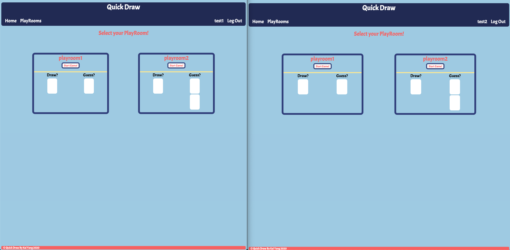
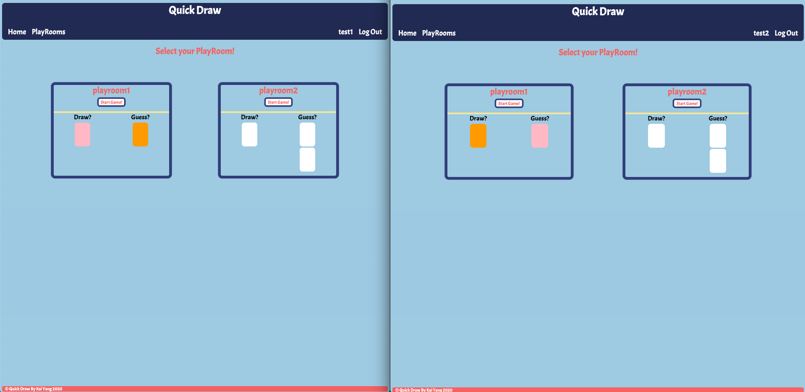
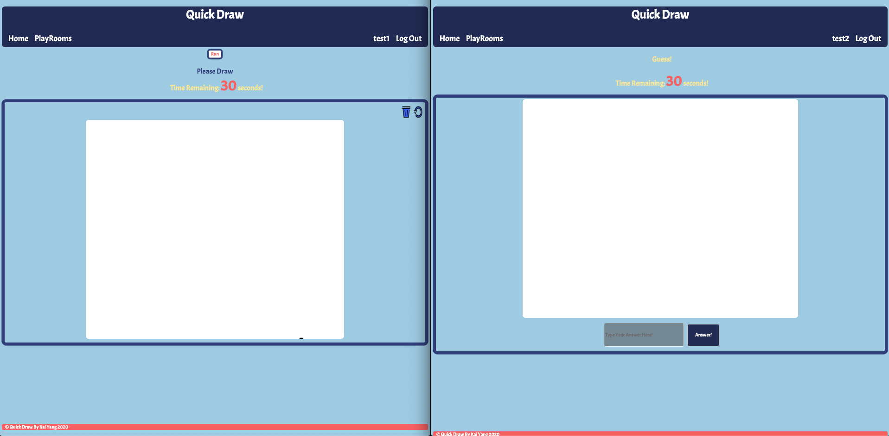
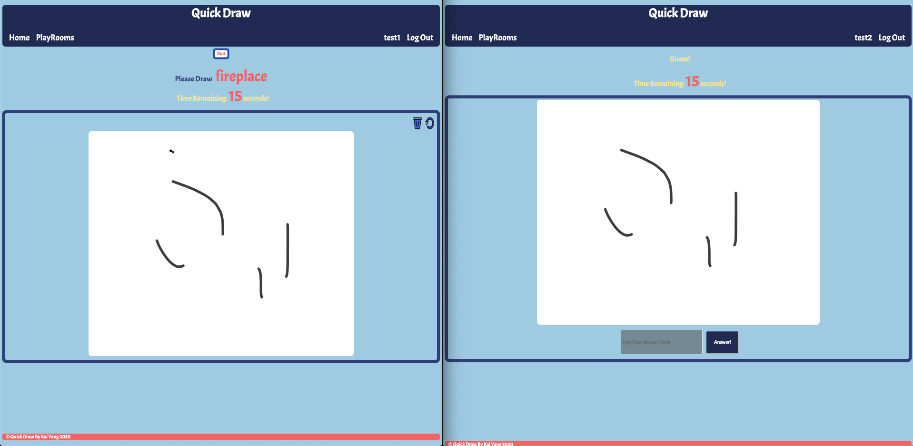
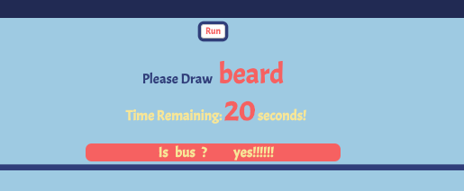

# quickdraw-frontend

## Introduction
It is a multiplayer drawing game. When users sign in, they can join playroom and select to be a drawer or a guesser. Drawer is provided a random word and draws on a canvas, and guesser should guess that word in 30 seconds.This application is using React as frontend. You can check Demo: https://kai-is-coding.github.io/quickdraw-frontend/#/, and backend github link: https://github.com/kai-is-coding/quickdraw-backend-with-cookies

## Working Flow
Step1: You can either login or signup. For convenience, two login details are provided, 1. email: test1@ga.co password: chicken 2. email: test2@ga.co password: chicken . You should login with these details in two broswer tabs and two taps, and it is best in Incognito version as you are logining in a same machine.

Step2: After login, you can choose you playroom. For demonstration, I selected test1 as drawer and test2 as guesser in playroom1. For both users, they can see which spot has been taken at the same time.

Step3: test1 now can start the game by clicking Run. A random word is provided, and test1 should describe this word by drawing in canvas. At the same time, test2 can see the drawing and guess that word by typing the answer in input area in 30 seconds.


Step4: Once the answer matches, test1 will be notfied.


## Frontend Code Explaination
All components are rendered inside `Routes.js`. Here, user login status is also been checked and send to each components.
```
<Switch>
  <Route exact path="/" component={Home}/>
  <Route exact path="/playrooms" render={
    props => (<PlayRooms {...props} handleLogin={this.handleLogin} loggedInStatus = {this.state.isLoggedIn}
    userDetails = {this.state.user}/>)
  }/>
  <Route exact path="/login" render={
    props => (<Login {...props} handleLogin={this.handleLogin} loggedInStatus = {this.state.isLoggedIn}/>)
  }/>
  <Route exact path="/signup" render={
    props => (<SignUp {...props} handleLogin={this.handleLogin} loggedInStatus = {this.state.isLoggedIn}/>)
  }/>
  <Route exact path="/playrooms/:id" render={
    props => (<DrawPage {...props} handleLogin={this.handleLogin} loggedInStatus = {this.state.isLoggedIn} userDetails =    {this.state.user} /> )
  }/>
</Switch>
```
The main function of this application is in `DrawPage.js`. When users selected either drawer or guesser, their roles had been defined. So, based on their player roles, they can only draw or guess in this page. Here, I used `ActionCable` to have real-time drawing feature. Also, I used `react-canvas-draw` to draw and send drawing data to `ActionCable`. The main code for WebSocket is:
```
// generate websocket connection
    this.cable = ActionCable.createConsumer(API_WS_ROOT);
    this.draw = this.cable.subscriptions.create(
      {channel: 'DrawsChannel', playroom: `${playroom_id}`},
      {
        connected: () => {
          console.log('DrawsChannel WS CONNECTED!');
        },
        received: (data) => {
          // console.log(data);
          if (this.loadableCanvas && data.action === "send_line"){
            // console.log('RECEIVED lines:', data.lines);
            this.loadableCanvas.clear();
            this.loadableCanvas.simulateDrawingLines({lines: data.lines, immediate: true});
          }
          else if (data.action === "send_message") {
            // console.log('receivedMessage:', data.inputMessage);
            this.setState({receivedMessage: data.inputMessage})
            // this.receivedMessage = data.inputMessage;
          }
          else if (data.action === "send_time") {
            // console.log('receivedTime:', data.time);
            this.setState({receivedSeconds: data.time});
          }
          else if (data.action === "send_word") {
            // this.setState({receivedCurrentWord: data.word});
            this.receivedCurrentWord = data.word
            console.log('receivedCurrentWord:', this.receivedCurrentWord);
          }
          else if (data.action === "send_game_status") {
            // console.log('changed game status!!!!!!!!!!!!!!!!!!!!!!!!!!!!!!!!!!')
            if (data.status === 'true') {
              this.startGame();
            }
          }
          else if (data.action === "send_find") {
            this.setState({findMessage: data.find})
          }
        },

        sendLine: function(lines){
          this.perform('send_line', lines);
        },

        sendMessage: function(message){
          this.perform('send_message', message);
        },

        sendTime: function(time){
          this.perform('send_time', time);
        },

        sendWord: function(word){
          this.perform('send_word', word);
        },
        sendGameStatus: function(status){
          this.perform('send_game_status', status)
        },
        sendFind: function(find){
          this.perform('send_find', find);
        }
      }
    );//this.draw

```
The data that need to be real-time changing is transformed through WebSocket and received by Backend Channels. Details will be provided in Backend `README.md`. The key point here is ``` playroom: `${playroom_id}` ``` , and at Backend, the data only can be broadcasted in this specified channel. So, only users in this playroom can see these real-time changing.

## Existing bugs
There are still some bugs with word generation.
## Roadmap
The next step for this project is adding some other features, such as loading page, automatically starting game when playroom is full.
## Authors and acknowledgement
I would like to thank my instructors, Luke Hammer, Josh Parry and Ana Silva who is helping me get through the entire project. Also, I would like the authors of this article https://medium.com/how-i-get-it/react-with-rails-user-authentication-8977e98762f2 and creators of `react-canvas-draw` and `actioncable`.


